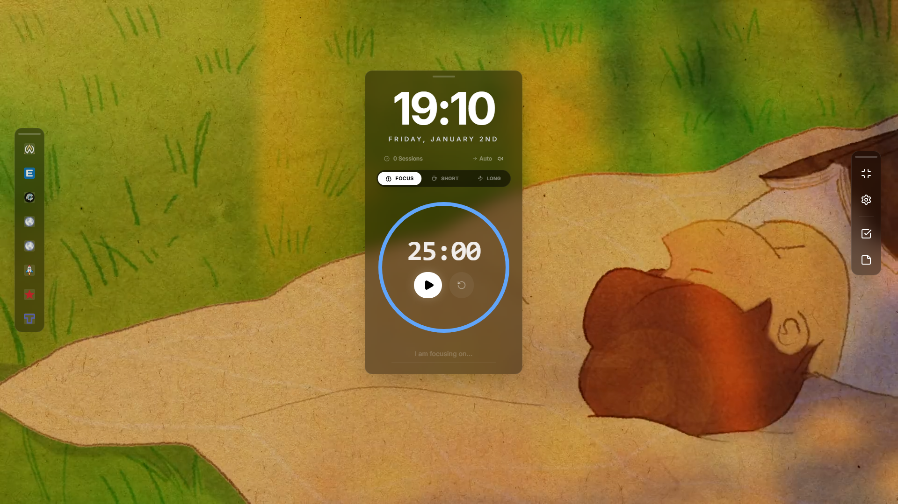

# ZenFocus HUD
**A Cinematic, ADHD-Friendly Productivity Dashboard**

ZenFocus is a **Minimalist "Heads-Up Display" (HUD)** designed to help you enter and maintain a flow state. It combines an ambient video background with a powerful Pomodoro timer and essential productivity tools, all in a distraction-free interface.



## Key Features

### Advanced Pomodoro Timer
- **Circular Visuals:** Beautiful, animated progress ring.
- **Flow State Tools:** "Focus Intent" input (`I am focusing on...`) to anchor your attention.
- **Smart Breaks:** Configurable "Long Break" interval.
- **Background Integrity:** Works perfectly even when the tab is inactive.

### Cinematic Atmosphere
- **Curated Recommendations:** One-click access to **Lofi Girl**, **Puuung**, and **Nature** streams.
- **Local Playlist Support:** Drag & Drop a folder of music/videos.
    - **Offline Storage:** Files are saved locally (IndexedDB) and restore instantly on reload.
    - **Folder Playback:** Automatically creates a playlist from all media in a folder.
- **Dual Modes:**
    - **YouTube Mode:** Stream online content with history tracking.
    - **Local Media Mode:** Play your own MP3/MP4 collection offline.

### Full PWA Support
- **Installable:** Works as a native desktop application (Mac/Windows/Linux).
- **100% Offline Capable:** The app shell And your local playlists work without internet.
- **Service Worker:** Automatic caching for reliable performance.

### Smart Integration
- **Media Player Widget:** Draggable, persistent controls for your local playlists.
- **Quick Links:** Customizable dock for your most-used sites.
- **Data Backup:** Export/Import your entire configuration (JSON) to save your setup.

## Getting Started

### Option 1: The Easy Way (Install)
1. Open the deployed application.
2. Click the **Install** icon in your browser's address bar.
3. Launch **ZenFocus** from your desktop or dock.

### Option 2: Run Locally (Developers)
Clone the repository and install dependencies:
```bash
git clone https://github.com/yourusername/zenfocus.git
cd zenfocus
npm install
```

Run the development server:
```bash
npm run dev
```

Build for production (enables PWA & offline support):
```bash
npm run build
npm start
```

## Built With
- **Next.js 16** (App Router)
- **Tailwind CSS 4** (Styling)
- **Framer Motion** (Animations)
- **Lucide React** (Icons)
- **PWA** via `@ducanh2912/next-pwa`
- **IndexedDB** (`idb-keyval`) for local file persistence

## Integration Guide
Want to plug ZenFocus into another app? You have two options:

### Option A: The "Component" Method (Next.js / React)
Best for deep integration.
1.  Copy the `src/components` folder to your project.
2.  Install dependencies: `npm install framer-motion lucide-react date-fns idb-keyval`.
3.  Import and use the `SplitView` component.

### Option B: The "Iframe" Method (Any Stack)
Best for quick setup. Deploy ZenFocus (e.g., to Vercel) and embed it:
```html
<iframe 
  src="https://your-zenfocus-deploy.vercel.app" 
  style="width: 100vw; height: 100vh; border: none;"
  allow="fullscreen; autoplay; encrypted-media"
></iframe>
```

## License
This project is open source and available under the [Apache 2.0 License](LICENSE).
